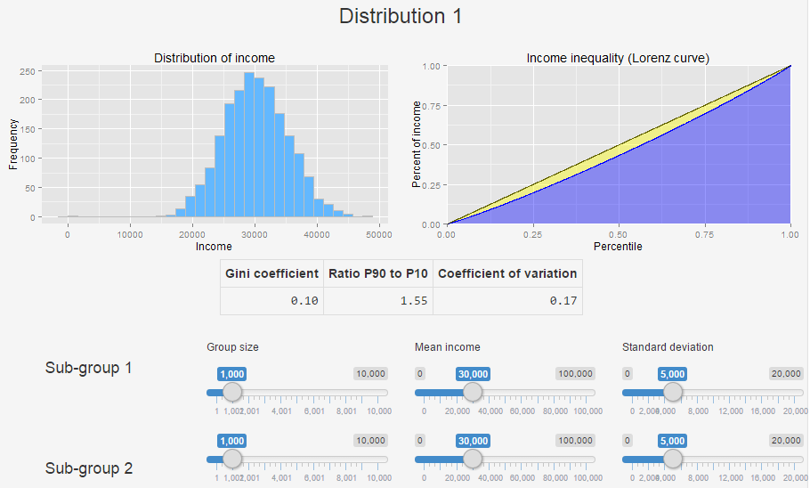

## Usage

---

## Future extensions

- Allow the user to choose which distributions to draw random samples from
- Add more control of distributions
- Add additional measures of income inequality
- Add possibility to make comparison with actual data by selected countries
